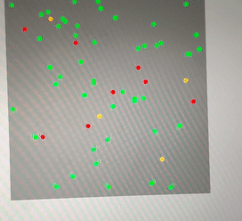

# INF06205 Project - Fall 2020 - Team 5

## Virus Transmission Simulation

To simulate the spread of a virus, taking in account the following factors:
- Total Population
- Infected Population
- Social Distancing
- Infection Rate
- Death Rate



## Team

- Deepansh Sachdeva (NUID 001399788)
- Sunil Yadav (NUID)

## Installation & Usage

### Clone the repository
```
git clone https://github.com/deepanshsachdeva/info6205-final-project.git
```

### Running Project
1. Go to GridView.java
2. Run main method
3. Modify the parameters in the panel
4. Press start to run simulation
5. Press reset to reset simulation


## License

This project is licensed under the MIT - see the [LICENSE](LICENSE) file for details
