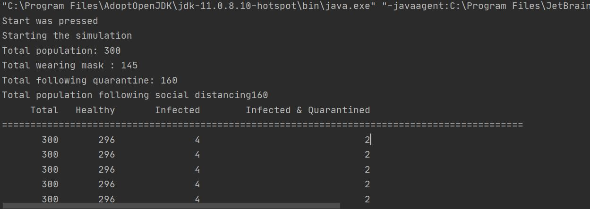
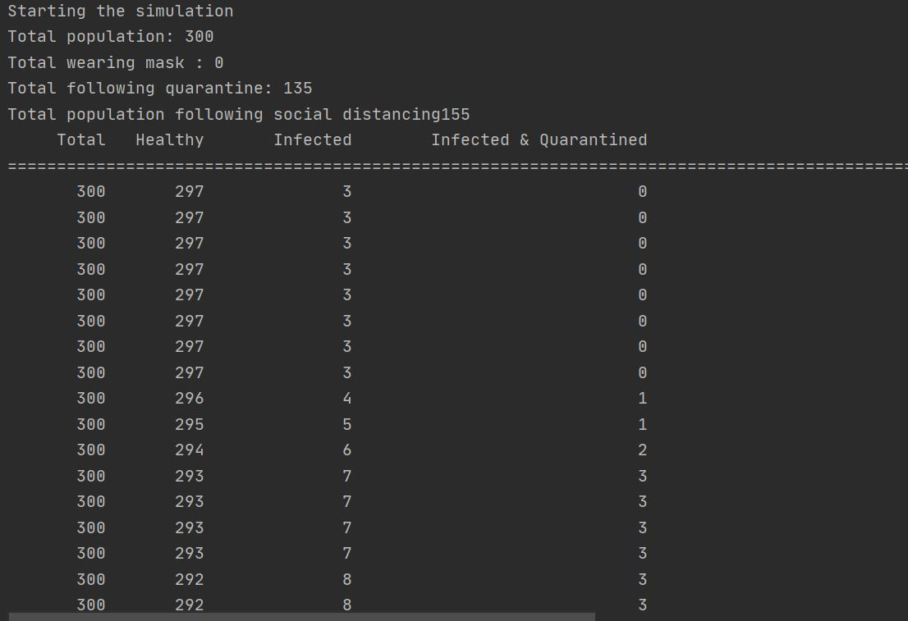
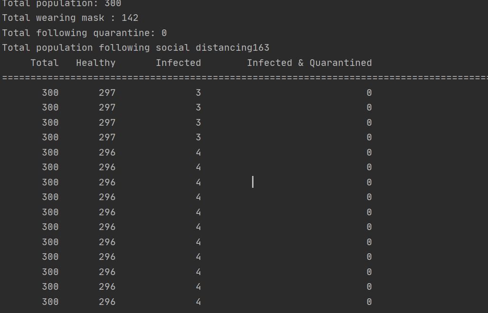

# Program Structures & Algoritms(INFO6205) Project - Fall 2020

## Virus Transmission Simulation

To simulate the spread of a virus, taking in account the following factors:
- Total Population
- Infected Population
- Infection Rate
- Social Distancing
- Wearing masks
- Follow quarantine
- Contact Tracing


## Team #5
- Deepansh Sachdeva (NUID 001399788)
- Sunil Yadav (NUID 001492711)

## Screenshots

### All mandates followed


### Mask & Quarantine NOT followed


### Mask mandate NOT followed


### Quarantine mandate NOT followed


## Installation & Usage

### Clone the repository
```
git clone https://github.com/deepanshsachdeva/info6205-final-project.git
```

### Running Project
1. Go to GridView.java
2. Run main method
3. Modify the parameters in the panel
4. Press start to run simulation
5. Press reset to reset simulation


## License
This project is licensed under the MIT - see the [LICENSE](LICENSE) file for details
